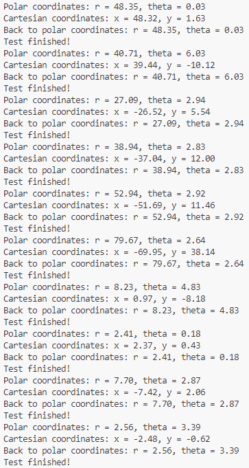
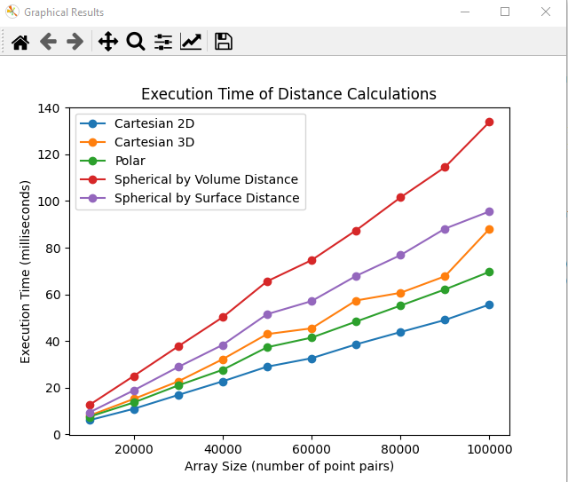

## Реалізація перетворень між системами координат. Колєснік Євгеній ІПЗ-4.01

## Мета роботи

Ознайомитися з різними системами координат (декартовою, полярною та сферичною) та отримати практичні навички у переході між ними. Визначити обчислювальну ефективність розрахунку відстаней у цих системах координат через бенчмаркінг.

## Завдання

Згідно до поставленого завдання необхідно було створити веб-додаток, що в реальному часі відображає дані про задетектовані цілі на графіку та дозволяє змінювати параметри радару.

1. Перехід між системами координат:

Двовимірний простір: Декартова та полярна системи координат.
- Задати координати декількох точок у полярній системі координат;
- Перевести ці координати в декартову систему координат;
- Здійснити зворотний перехід з декартової системи координат в полярну;
- Перевірити коректність розрахунків, упевнившись, що вихідні координати співпадають з отриманими після зворотного перетворення.

Тривимірний простір: Декартова та сферична системи координат.
- Задати координати декількох точок у сферичній системі координат;
- Перевести ці координати в декартову систему координат;
- Здійснити зворотний перехід з декартової системи координат в сферичну;
- Перевірити коректність розрахунків, упевнившись, що вихідні координати співпадають з отриманими після зворотного перетворення.

2. Розрахунок відстаней у сферичній системі координат. Виконати обчислення відстані між точками у сферичній системі координат двома способами:
- Декартова система координат: Використати стандартну формулу для обчислення прямої відстані у двовимірному та тривимірному просторі;
- Полярна система координат: Використати формулу для обчислення відстані між точками у двовимірному просторі;
- Сферична система координат: Виконати обчислення відстані між точками двома способами:

  a) Через об'єм сфери: використати формулу для прямої відстані у тривимірному просторі;

  б) По поверхні сфери: використати формулу для великої колової відстані.

3. Бенчмарки продуктивності:
- Згенерувати масив координат пар точок у кожній системі координат (декартова, полярна, сферична);
- Виконати розрахунок відстаней між цими точками для кожної системи координат;
- Виміряти тривалість обчислень для кожної системи координат;
- Обрати такий розмір масиву, за якого результат бенчмаркінгу матиме незначну варіативність від запуску до запуску (рекомендовано розмір масиву 10,000 - 100,000 точок).

## Засоби розробки

Для створення проєкту було обрано мову python. Вона дозволяє легко виконувати математичні обчислення та візуалізувати дані за допомоги бібліотеки Matplotlib.

## Класи систем координат

У окремих файлах були створені класи для систем координат. Вони містять конструктори для встановлення значень, методи для вирахування дистанції між точками у одній системі та методи перетворення між системами координат.

Для тривимірної сферичної системи присутні два методи обчислення дистанції: `distance_through_volume(self, other_point)` та `distance_on_surface(self, other_point)`.

## Тестування переходу між координатами

Скрипт `src/trans_test.py` використовується для тестування перетворення координат між системами. В ньому відбувається створення списку точок у полярній системі координат та потім у циклі кожна точка переноситься у декарову систему та навпаки. Якщо оберненні значення збігаються для усіх точок, то це означає, що тест виконаний.

Запустимо скрипт: 

> python src/trans_test.py

*Консольний вивід:*

Тест виконався до кінця та без помилок, перетворення між координатними системами працює без збоїв.

## Аналіз часу визначення дистанцій між точками у різних системах координат

Скрипт `src/distance_test.py` використовується для будування графіків аналізів часу обчислення дистанції між точками у різних системах координат. Скрипт генерує пари точок у різних системах координат та проводячи декілька ітерацій вираховує час обчислення дистанції.

Для побудови графіків використовується бібліотека `matplotlib`.

Запустимо скрипт: 

> python src/distance_test.py

*Запущене вікно:*

З результатів виконання програми видно, що найбільш швидко виконується обчислення у двомірних системах, а найбільш затратні у тривимірних системах. Серед варіантів обчислення дистанції у сферичній системі координат найбільш затратне обчислення скрізь об'єм, а найменш затратне по поверхні.

## Висновок

Виконуючи цю роботу я підтвердив теоретичний матеріал по реалізації перетворень між системами координат. Під час виконання роботи я ознайомився з різними системами координат та отримав практичні навички у переході між ними, визначив обчислювальну ефективність розрахунку відстаней у цих системах координат через бенчмаркінг та побудував графіки залежностей часу від кількості точок та методів перетворення за допомоги бібліотеки matplotlib.

З результатів виконання аналізу було вивидено, що обчислення у декартових системах координат займає найменшу кількість часу серед поданих систем.

Отриманні знання є основою при розробці  систем пов'язаних з роботою з координатами.